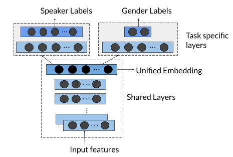

## Hive-MTL: Unified Voice Embedding through Multi-task Learning.
[![Contributors][contributors-shield]][contributors-url]
[![Stargazers][stars-shield]][stars-url]
[![Forks][forks-shield]][forks-url]
[![Issues][issues-shield]][issues-url] | [Pretrained Models](https://drive.google.com/drive/folders/1Hw2BMs0clCrKoYIq0B0PWXnxuoVUPGci?usp=sharing).

Speech technologies is one of the evolving and highly demanded area for the past few decades due to the huge progress brought by machine learning technology. Especially the past decade has brought tremendous progress which includes the introduction of conversational agents. In this work we describe a multi-task deep metric learning system to learn a single unified audio embedding which can be used to power our multiple audio/speaker  specific tasks. The solution we present not only allows us to train for multiple application objectives in a single deep neural network architecture, but takes advantage of correlated information in the combination of all training data from each application to generate a unified embedding that outperforms all specialized embeddings previously deployed for audio/speaker  specific task.


### Architecture Diagram




## Getting started
### Install dependencies
#### Requirements
- tensorflow>=2.0
- keras>=2.3.1
- python>=3.6
```bash
pip install -r requirements.txt
```

If you see this error: `libsndfile not found`, run this: `sudo apt-get install libsndfile-dev`.


### Training

The code for training is available in this repository.
```bash
sudo chmod -R 777 hive-mtl/ # Give write permision to hive-mtl
pip uninstall -y tensorflow && pip install tensorflow-gpu
./hive-mtl download_librispeech # Download Librispeech dataset

```


## Contributing

Please read [CONTRIBUTING.md](https://github.com/Jenarthanan14/Voice-Feature-Extraction/blob/master/CONTRIBUTING.md) for details on our code of conduct, and the process for submitting pull requests to us.

## Authors

* **Rajenthiran Jenarthanan**
* **Lakshikka Sithamparanathan**
* **Saranya Uthayakumar**

See also the list of [contributors](https://github.com/Jenarthanan14/Voice-Feature-Extraction/contributors) who participated in this project.

## References

* [Deep Speaker](http://daringfireball.net/projects/markdown/) : An End-to-End Neural Speaker Embedding System by Chao Li, Xiaokong Ma, Bing Jiang, Xiangang Li.

## Acknowledgments

* Ketharan Suntharam
* Sathiyakugan Balakirshnan

[contributors-shield]: https://img.shields.io/github/contributors/Jenarthanan14/Voice-Feature-Extraction.svg?style=flat-square
[contributors-url]: https://github.com/Jenarthanan14/Voice-Feature-Extraction/graphs/contributors
[forks-shield]: https://img.shields.io/github/forks/Jenarthanan14/Voice-Feature-Extraction.svg?style=flat-square
[forks-url]: https://github.com/Jenarthanan14/Voice-Feature-Extraction/network/members
[stars-shield]: https://img.shields.io/github/stars/Jenarthanan14/Voice-Feature-Extraction.svg?style=flat-square
[stars-url]: https://github.com/Jenarthanan14/Voice-Feature-Extraction/stargazers
[issues-shield]: https://img.shields.io/github/issues/Jenarthanan14/Voice-Feature-Extraction.svg?style=flat-square
[issues-url]: https://github.com/Jenarthanan14/Voice-Feature-Extraction/issues
[license-shield]: https://img.shields.io/github/license/Jenarthanan14/Voice-Feature-Extraction.svg?style=flat-square
[license-url]: https://github.com/Jenarthanan14/Software-Engneering-Project/blob/master/LICENSE.txt
[linkedin-shield]: https://img.shields.io/badge/-LinkedIn-black.svg?style=flat-square&logo=linkedin&colorB=555
[linkedin-url]: https://www.linkedin.com/in/jenarthanan-rajenthiram/
[travis-image]: https://img.shields.io/travis/dbader/node-datadog-metrics/master.svg?style=flat-square
[travis-url]: https://travis-ci.org/dbader/node-datadog-metrics
[npm-downloads]: https://img.shields.io/npm/dm/datadog-metrics.svg?style=flat-square
[npm-url]: https://npmjs.org/package/datadog-metrics
